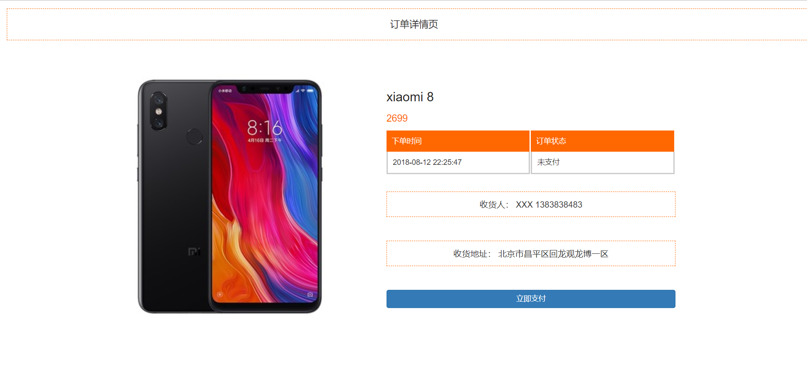

## 基于 SpringBoot+SpringSession+Redis+RabbitMQ 秒杀系统

## 秒杀系统项目启动说明

1、启动前，请配置 application.properties 中相关redis、mysql、rabbitmq地址。

2、登录地址：http://localhost:8888/page/login   

3、商品秒杀列表地址：http://localhost:8888/goods/list
## 支付宝沙箱配置说明
买家虚拟账号

支付宝生成应用公钥和私钥的app，开放平台有

这个页面生成支付宝公钥

最后写在配置文件中即可
## 其它说明

1、数据库共有一千个用户左右（手机号：从18077200000~18077200998 密码为：123456），为压测准备的。（使用 cn.hfbin.seckill.util.UserUtil.java该类生成的，生成token做压测也是在此类里面）

2、此项目master分支只是完成了秒杀的所有业务逻辑功能,优化说明：

    1)、页面缓存、商品详情静态化、订单静态化（感兴趣可以把所有页面都做静态化）
    2)、加入消息队列RabbitMQ，对秒杀接口进行优化。
    3)、隐藏秒杀接口地址
    4)、接口限流防刷(在拦截器通过Redis + 注解限流，采用Lua脚本的原子性实现严格的限流）
    5)、解决超卖问题(单用户多线程并发问题-redis分布式锁，注意过期时间，多用户并发问题-采用的是Redis原子性操作)
    6)、验证码机制实现流量的错峰，用SpringSession的方式存储验证码，解决Session的共享问题
    7)、用RabbitMq实现异步下单功能，对数据库字段进行限制实现幂等性
    8)、用RabbitMq实现延时队列的功能，实现30Min取消秒杀订单的服务，用户然后可以重复秒杀
    9)、用支付宝沙箱环境实现虚拟的支付功能，这个需要自己去natApp来实现内网穿透功能，以及去支付宝开放平台去申请支付宝的公钥，应用的公钥和私钥，写在配置中
### 页面截图
登录页

商品列表情页

商品详情页

订单详情页

